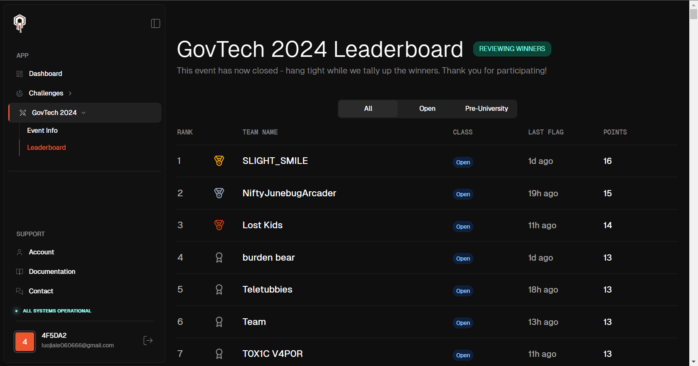

# sg-ai-ctf-writeup

Hello, we are team **Lost Kids** from National University of Singapore.

From 26th to 27th Oct, we participated in **SG AI CTF** prelims hosted by **GovTech**. We obtained 14 points out of 19 and achieved 3rd place in the preliminary round. We are lucky enough to be qualified for the final round!

### Links to challenge writeups

autopilot1

autopilot2

extractor

extractor2

fiftycats

carbender

sonotype

genigma

voyager2

### Relevant websites

[CTF website](https://crucible.dreadnode.io/challenges/event/govtech-2024/info)

[CTFtime event](https://ctftime.org/event/2546/)

